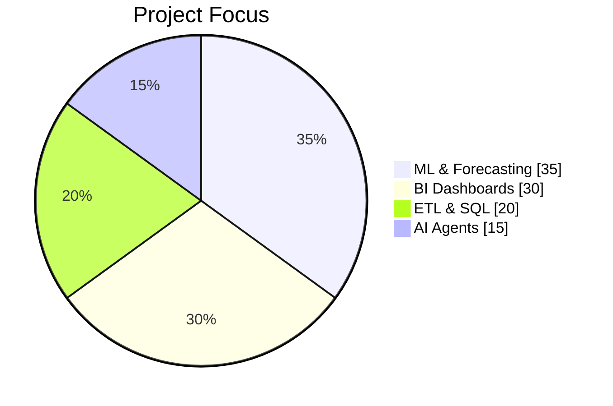
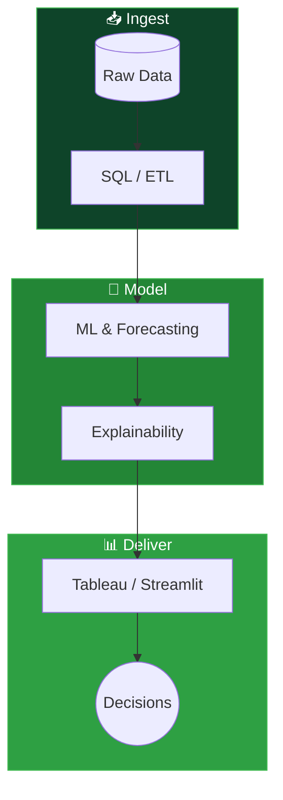

<!-- Profile README · Gorisi Deepak Reddy -->

 

  

**I turn messy operational data into forecasts, models, and dashboards that leaders can act on.**

📍 Budapest, Hungary &nbsp;•&nbsp; 🎓 MSc in IT for Business Data Analytics &nbsp;•&nbsp; 🟢 Open to Data / ML / Analytics roles in EU

 

 

### ⚡ Quick Navigate

---

## 👋 About Me

<table>
<tr>
<td width="60%">

I'm **Gorisi Deepak Reddy**, an MSc **Business Data Analytics** graduate in **Budapest**. I build end-to-end analytics · **SQL/ETL → ML/forecasting → Tableau/Streamlit** · with a focus on decisions stakeholders can act on.

</td>
<td width="40%">

</td>
</tr>
</table>

<b>📋 Profile snapshot · click to collapse</b>

 

| | |
|:---|:---|
| 🎯 **Role** | Data Scientist · ML Engineer · Data Analyst · Business Analyst · Data Engineer |
| 🔬 **Focus** | Predictive ML · Time Series · ETL/SQL · BI & Decision Systems |
| 🛠️ **Strength** | PostgreSQL → Python/Scikit-Learn → Tableau/Power BI/Streamlit |
| 📍 **Location** | Budapest, Hungary · open to roles across the EU |
| 🚀 **Currently** | Shipping production-style analytics & LLM automation projects |
| 💼 **Open to** | Data Scientist · ML Engineer · Data Analyst · Business Analyst · Data Engineer |

<b>🚀 Recent builds · click to expand</b>

 

- **Last-mile delivery analytics (Budapest)** · SLA & financial bleed audit · Random Forest SLA predictor · Tableau exec dashboard
- **MSc capstone · trade policy risk** · ML decision support · Random Forest **RMSE 0.0412**
- **Inflation forecasting** · Prophet, SARIMAX, XGBoost on **24+ years** of macro data
- **UNICEF transaction analysis** · anomaly detection across five global processes
- **AutoCV** · Streamlit + Playwright + Groq Llama-3 job application agent

| 🎯 Capstone ML | 📈 Forecasting | 🚴 Ops Analytics | 🤖 AI Product |
|:---:|:---:|:---:|:---:|
| **RMSE 0.0412** | **24+ yr** macro data | SLA + cost audit | Playwright + Groq |
| Supply-chain risk | Prophet · SARIMAX | Budapest network | Auto job agent |

---

👇 Click any project card to expand details & dashboard previews

## ⭐ Interactive Project Showcase

 

  <b>🚴 Last-Mile Delivery Analytics · Budapest</b>
  &nbsp;
  
  
  

 

| **Problem** | SLA breaches & payout bleed in high-volume last-mile networks |
| **Solution** | PostgreSQL audit → Random Forest SLA predictor → Tableau dashboard |
| **Impact** | 5+ min SLA flags · 10%+ route cost bleed · Buda · Pest routing insights |

*📊 Tableau executive dashboard · SLA & financial bleed monitoring*

  <b>📈 Inflation Forecasting & Decision System</b>
  &nbsp;
  
  
  

 

| **Problem** | Macro inflation planning across multi-decade cycles |
| **Solution** | Prophet · SARIMAX · XGBoost with automated RMSE/MAPE evaluation |
| **Impact** | Rigorous benchmarking on **24 years** of macroeconomic data |

*📊 Interactive forecasting dashboard · model comparison & confidence intervals*

  <b>🌍 UNICEF Transaction Volume Analysis</b>
  &nbsp;
  
  

 

| **Problem** | Monitor service delivery across five global transaction processes |
| **Solution** | Trend analysis · anomaly detection · monthly performance evaluation |
| **Context** | UNICEF Global Shared Services Centre · Business Data & Analytics assignment |

*📊 Stakeholder dashboard · trends, anomalies & service delivery KPIs*

  <b>🌐 AI-Driven Trade Policy & Sourcing Risk · MSc Capstone</b>
  &nbsp;
  
  

 

| **Problem** | Trade Policy Uncertainty & tariff shock impact on global sourcing |
| **Solution** | ML-based Decision Support System with sourcing recommendations |
| **Impact** | **RMSE 0.0412** on non-linear economic impact prediction |

  <b>🤖 AutoCV · AI Job Application Generator</b>
  &nbsp;
  
  

 

| **Problem** | Hours spent tailoring resumes per job posting |
| **Solution** | LinkedIn scrape → Groq Llama-3 rewrite → styled PDF resume + cover letter |
| **Impact** | Keyword-mapped applications with zero experience-loss prompt engineering |

---

## 📊 Live Dashboard Gallery

<b>🖼️ View all Tableau & BI dashboards · click to toggle</b>

 

<table>
<tr>
<td width="33%" align="center">

 <b>Last-Mile Ops</b>
</td>
<td width="33%" align="center">

 <b>Inflation Forecast</b>
</td>
<td width="33%" align="center">

 <b>UNICEF Analytics</b>
</td>
</tr>
</table>

---

 

## 🛠️ Tech Stack

<b>💻 Languages & Data · click to expand/collapse</b>

 

<b>🤖 ML, Deep Learning & Forecasting</b>

 

<b>📊 BI, Apps & Cloud</b>

 

---

<b>💡 What I bring · click to expand</b>

 

- **Production mindset** · leakage-safe features, class imbalance, reproducible pipelines
- **Stakeholder fluency** · executive dashboards, not just model scores
- **Full-stack analytics** · ingest → model → visualize → recommend
- **AI-native builder** · LLM agents with real automation (scraping, PDF, APIs)

---

## 📈 GitHub Analytics

  

  

 

<b>🐍 Contribution Snake · auto-updates daily</b>

 

<picture>
  <source media="(prefers-color-scheme: dark)" srcset="https://raw.githubusercontent.com/thedeepakreddy/thedeepakreddy/output/github-contribution-grid-snake-dark.svg"/>
  <source media="(prefers-color-scheme: light)" srcset="https://raw.githubusercontent.com/thedeepakreddy/thedeepakreddy/output/github-contribution-grid-snake.svg"/>
  
</picture>

---

## 📬 Let's Connect

If you're hiring for **Data Science**, **ML Engineering**, **Data Analytics**, **Business Analytics**, or **Data Engineering** · I'd love to chat.

 

<table>
<tr>
<td align="center" width="33%">

</td>
<td align="center" width="33%">

</td>
<td align="center" width="33%">

</td>
</tr>
</table>

 

 

