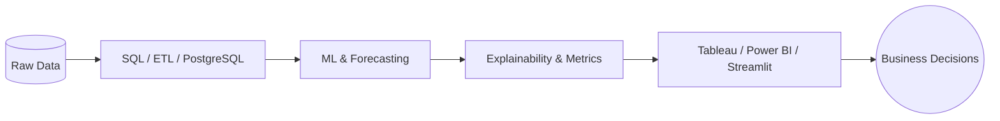

<!-- Professional GitHub Profile README — Gorisi Deepak Reddy -->

 

  

**I turn messy operational data into forecasts, models, and dashboards that leaders can act on.**

📍 Budapest, Hungary &nbsp;•&nbsp; 🎓 MSc Business Analytics &nbsp;•&nbsp; 🟢 Open to Data / ML / Analytics roles in EU

 

---

## 👋 About Me

I'm **Gorisi Deepak Reddy**, an MSc **Business Data Analytics** graduate based in **Budapest, Hungary**, focused on building analytics products that move from raw data to real business decisions. I work across the full stack of analytics — **SQL/ETL pipelines**, **predictive ML & time-series forecasting**, and **Tableau / Streamlit dashboards** — so stakeholders get answers they can trust and act on, not just model outputs in a notebook.

| | |
|:---|:---|
| 🎯 **Role** | Data Scientist · ML Engineer · Analytics Consultant |
| 🔬 **Focus** | Predictive ML · Time Series · ETL/SQL · BI & Decision Systems |
| 🛠️ **Strength** | PostgreSQL → Python/Scikit-Learn → Tableau/Power BI/Streamlit |
| 📍 **Location** | Budapest, Hungary — open to roles across the EU |
| 🚀 **Currently** | Shipping production-style analytics & LLM automation projects |
| 💼 **Open to** | Data Scientist · ML Engineer · Analytics Engineer · BI Developer |

**What I've built recently**

- **Last-mile delivery analytics (Budapest)** — end-to-end pipeline auditing SLA breaches and financial bleed; Random Forest for pre-dispatch delay prediction; executive Tableau dashboard with spatial routing insights.
- **MSc capstone — trade policy & sourcing risk** — ML decision support system for tariff-shock impact; Random Forest with **RMSE 0.0412** and actionable sourcing recommendations.
- **Inflation forecasting** — Prophet, SARIMAX & XGBoost on **24+ years** of macro data with automated RMSE/MAPE benchmarking and Tableau visual analytics.
- **UNICEF transaction analysis** — trend monitoring, anomaly detection & service-delivery performance across five global processes.
- **AutoCV (AI job agent)** — Streamlit app using Playwright + Groq Llama-3 to tailor resumes and cover letters per job posting.

I care about **leakage-safe modeling**, clear evaluation metrics, and designs that executives and operators can actually use day to day.

---

## 🏆 Impact at a Glance

| Metric | Highlight |
|:------:|:----------|
| **Capstone ML** | Random Forest supply-chain risk — **RMSE 0.0412** |
| **Forecasting** | **24+ years** macro data — Prophet, SARIMAX, XGBoost benchmarking |
| **Ops Analytics** | Last-mile SLA breach prediction + financial bleed audit (Budapest) |
| **AI Product** | End-to-end job-application agent — Playwright + Groq Llama-3 |
| **Public repos** | **6** end-to-end analytics & ML projects (pinned below) |

---

## ⭐ Featured Projects

 

### 🚴 Last-Mile Delivery Analytics — Budapest

| | |
|---|---|
| **Problem** | SLA breaches & payout bleed in high-volume last-mile networks |
| **Solution** | PostgreSQL audit pipeline → Random Forest SLA predictor → Tableau exec dashboard |
| **Stack** | `PostgreSQL` `Python` `Scikit-Learn` `Tableau` `Pandas` |
| **Impact** | Flagged 5+ min SLA violations, 10%+ route cost bleed; spatial Buda–Pest routing insights |

 

### 🌐 AI-Driven Trade Policy & Sourcing Risk (MSc Capstone)

| | |
|---|---|
| **Problem** | Trade Policy Uncertainty (TPU) & tariff shock impact on global sourcing |
| **Solution** | ML-based Decision Support System with actionable sourcing recommendations |
| **Stack** | `Random Forest` `Python` `Pandas` `Jupyter` |
| **Impact** | **RMSE 0.0412** on non-linear economic impact prediction |

 

### 📈 Inflation Forecasting & Decision System

| | |
|---|---|
| **Problem** | Macro inflation planning across multi-decade economic cycles |
| **Solution** | Comparative time-series stack with automated RMSE/MAPE evaluation |
| **Stack** | `Prophet` `SARIMAX` `XGBoost` `Python` `Tableau` |
| **Impact** | Rigorous model benchmarking on **24 years** of macroeconomic data |

 

### 🤖 AutoCV — AI Job Application Generator

| | |
|---|---|
| **Problem** | Hours spent tailoring resumes per job posting |
| **Solution** | Streamlit app: LinkedIn scrape → LLM rewrite → styled PDF resume + cover letter |
| **Stack** | `Streamlit` `Playwright` `Groq API` `Llama-3.3-70b` `Python` |
| **Impact** | Keyword-mapped applications with zero experience-loss prompt engineering |

 

### 🌍 UNICEF Transaction Volume Analysis

| | |
|---|---|
| **Problem** | Monitor service delivery across five global transaction processes |
| **Solution** | Trend analysis, anomaly detection & monthly performance evaluation |
| **Stack** | `Python` `Pandas` `Anomaly Detection` |
| **Context** | Business Data & Analytics assignment — UNICEF Global Shared Services Centre |

 

<b>📂 All repositories</b>

| Repository | Type | Description |
|------------|:----:|-------------|
| [Last-Mile-Delivery-Analytics-Budapest](https://github.com/thedeepakreddy/Last-Mile-Delivery-Analytics-Budapest) | 🏢 Ops | SLA & financial bleed audit pipeline |
| [AI-Driven-Trade-Policy-Impact-and-Decision-Support-System](https://github.com/thedeepakreddy/AI-Driven-Trade-Policy-Impact-and-Decision-Support-System) | 🎓 MSc | Trade policy ML decision system |
| [Inflation-Forecasting-Decision-System](https://github.com/thedeepakreddy/Inflation-Forecasting-Decision-System) | 📊 Macro | Multi-model inflation forecasting |
| [AutoCV_AI-Powered_Application_Generator](https://github.com/thedeepakreddy/AutoCV_AI-Powered_Application_Generator) | 🤖 AI | LLM + Playwright application agent |
| [UNICEF-Transaction-Volume-Analysis](https://github.com/thedeepakreddy/UNICEF-Transaction-Volume-Analysis) | 🌐 NGO | Transaction volume & anomaly analytics |

---

## 🛠️ Tech Stack

<table>
<tr>
<td valign="top" width="33%">

**Languages & Data**
  

</td>
<td valign="top" width="33%">

**ML & Forecasting**
  

</td>
<td valign="top" width="33%">

**BI, Apps & Cloud**
  

</td>
</tr>
</table>

---

## 📊 GitHub Analytics

  

---

## 🧭 What I Bring to a Team

- **Production mindset** — leakage-safe features, class imbalance, reproducible pipelines  
- **Stakeholder fluency** — executive dashboards, not just model scores  
- **Full-stack analytics** — ingest → model → visualize → recommend  
- **AI-native builder** — LLM agents with real automation (scraping, PDF, APIs)

---

## 📬 Let's Connect

If you're hiring for **Data Science**, **ML Engineering**, **Analytics Engineering**, or **BI** — I'd love to chat.

 

 

