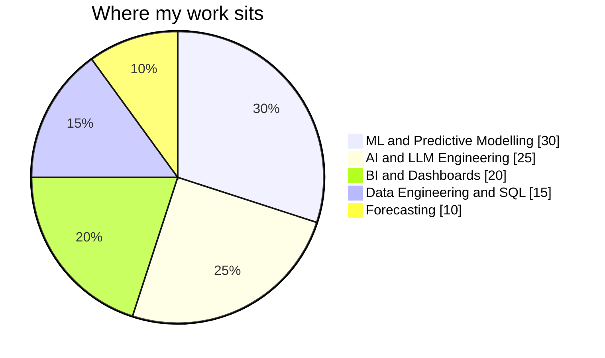
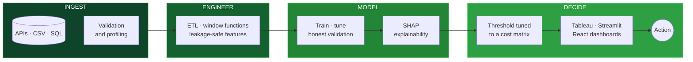

<!-- Profile README · Gorisi Deepak Reddy -->

<div align="center">


<br/>


<br/><br/>

### **I turn messy operational data into forecasts, models and dashboards that leaders act on.**

**MSc Business Data Analytics** · Budapest · shipping production-style analytics and AI systems — most of them **live and clickable** below.

<br/>

[](mailto:thedeepakreddy1@gmail.com)
[](https://www.linkedin.com/in/deepak-reddy-038582223/)
[](https://github.com/thedeepakreddy)

<br/>

**JUMP TO**

[](#role-fit)
[](#featured-projects)
[](#dashboard-gallery)
[](#tech-stack)
[](#github-analytics)
[](#connect)

<br/>


</div>

## Role Fit

> **Recruiters — start here.** Find the role you are hiring for, then click straight through to the code that proves it.

| Hiring for | What I actually do | Proof you can open right now |
|:---|:---|:---|
| **Data Scientist** | Leakage-safe pipelines, class imbalance, threshold optimisation tied to profit, SHAP explainability | [Prescriptive Churn](https://github.com/thedeepakreddy/Prescriptive-Churn-Analytics-in-E-commerce) · [Enterprise Churn](https://github.com/thedeepakreddy/Enterprise-Churn-Optimization) · [MSc Capstone](https://github.com/thedeepakreddy/AI-Driven-Trade-Policy-Impact-and-Decision-Support-System) |
| **ML Engineer** | XGBoost and LSTM ensembles, `TimeSeriesSplit` validation, FastAPI model microservices, scheduled retraining, CI | [Market Intelligence](https://github.com/thedeepakreddy/Automated-Market-Intelligence-Analyst) · [Data Science Studio](https://github.com/thedeepakreddy/AskDeepakAI-DataScienceStudio) · [Inflation Forecasting](https://github.com/thedeepakreddy/Inflation-Forecasting-Decision-System) |
| **AI Engineer** | LLM systems with **guardrails** — schema-constrained output, cost-aware routing, agentic tool-calling loops | [Risk Intelligence](https://github.com/thedeepakreddy/Automated-Risk-Intelligence-Analyst) · [ECHO Browser Agent](https://github.com/thedeepakreddy/Echo-Web-Assistant-Extension) · [Data Science Studio](https://github.com/thedeepakreddy/AskDeepakAI-DataScienceStudio) |
| **Data Analyst** | SQL window functions and CTEs, cohort baselines, anomaly detection, findings a manager reads in ten seconds | [Last-Mile Analytics](https://github.com/thedeepakreddy/Last-Mile-Delivery-Analytics-Budapest) · [UNICEF Analysis](https://github.com/thedeepakreddy/UNICEF-Transaction-Volume-Analysis) |
| **Data Engineer** | PostgreSQL and SQLite modelling, Medallion-style layering, 30-minute ingestion cycles, auditable persistence | [Last-Mile Analytics](https://github.com/thedeepakreddy/Last-Mile-Delivery-Analytics-Budapest) · [Risk Intelligence](https://github.com/thedeepakreddy/Automated-Risk-Intelligence-Analyst) |
| **BI Developer** | Executive Tableau dashboards, Streamlit decision apps, KPI design that maps to currency rather than accuracy | [Churn Sentinel](https://github.com/thedeepakreddy/Enterprise-Churn-Optimization) · [Prescriptive Churn](https://github.com/thedeepakreddy/Prescriptive-Churn-Analytics-in-E-commerce) · [Inflation Forecasting](https://github.com/thedeepakreddy/Inflation-Forecasting-Decision-System) |

<div align="center">

### Numbers I can defend in an interview

| Profit-optimised ML | Model quality | Ops audit | Capital at risk | AI cost engineering |
|:---:|:---:|:---:|:---:|:---:|
| **$1.51M** net retention profit | **ROC-AUC 0.9248** | **9,964** orders · **13.7M HUF** | **$4.7M** flagged | **~85%** requests on-device |
| threshold moved `0.50` to `0.28` | recall 0.79 · precision 0.88 | **686K HUF** overspend found | Gradient Boosting + SHAP | **5-7x** fewer LLM tokens |

<sub>Every figure above is traceable to a repository in this profile — use the Role Fit table.</sub>


</div>

## About Me

<table>
<tr>
<td width="58%" valign="top">

I am **Gorisi Deepak Reddy**, an **MSc Business Data Analytics** graduate based in **Budapest, Hungary**.

I build analytics that survive contact with a stakeholder. In practice that means:

- **The number has to be real.** Metrics are computed by real `scikit-learn` and `pandas` code, never narrated by an LLM.
- **Accuracy is not the goal, the decision is.** I optimise thresholds against a cost matrix, because a missed churner and a wasted coupon do not cost the same.
- **Honest validation.** Chronological splits and `TimeSeriesSplit` on financial data — the score is lower because it is not cheating.
- **Ship the last mile.** Notebook to API to dashboard to a person clicking a button.

Budapest · MSc IT for Business Data Analytics · **open to Data, ML, AI and BI roles across the EU**

</td>
<td width="42%" valign="top">


```mermaid
pie showData
    title Where my work sits
    "ML and Predictive Modelling" : 30
    "AI and LLM Engineering" : 25
    "BI and Dashboards" : 20
    "Data Engineering and SQL" : 15
    "Forecasting" : 10
```

</td>
</tr>
</table>

<details>
<summary><b>What I bring to a team — click to expand</b></summary>
<br/>

| | |
|:---|:---|
| **Production mindset** | Leakage-safe feature engineering, imbalance handled by re-weighting rather than blind SMOTE, reproducible pipelines, CI |
| **Stakeholder fluency** | I present forints and dollars, not F1 scores. Executive dashboards, not screenshots of a notebook |
| **Full-stack analytics** | Ingest, model, explain, visualise, recommend. I own the whole chain |
| **AI-native builder** | LLM agents with real guardrails: JSON schema constraints, tiered routing, graceful degradation, no fabricated metrics |
| **Intellectual honesty** | I report the metric that is defensible, and I document the trade-off that made it lower |

</details>

<div align="center">


<sub><b>Click any card to expand</b> — live demos, architecture and hard numbers inside</sub>

</div>

## Featured Projects

### AI and LLM Engineering

<details open>
<summary><b>Automated Risk Intelligence Analyst</b> &nbsp;    </summary>
<br/>

<a href="https://automated-risk-intelligence-analyst-1.onrender.com/"></a>
<a href="https://github.com/thedeepakreddy/Automated-Risk-Intelligence-Analyst"></a>

> **A market-risk desk that runs itself.** It reads the tape and the news flow, classifies every headline, scores systemic exposure 0-100, and writes the morning briefing — unattended, every 30 minutes.

| | |
|:---|:---|
| **Problem** | Risk desks do not fail for lack of data. They fail because unstructured news never becomes a comparable time-series metric fast enough to act on. |
| **Approach** | Gemini 2.5 Flash classifies each headline into a risk taxonomy (Market, Credit, Geopolitical, Liquidity, Regulatory, Operational) with a 1-10 severity score, under a **strict JSON schema**. VADER scores tone. Realised cross-asset volatility comes from the price tape. |
| **The score** | `MasterRisk = 0.40*Severity + 0.30*SentimentRisk + 0.30*Volatility` — fully transparent, nothing black-box. Every run **persists its inputs**, so any historical reading can be decomposed and audited later. |
| **Coverage** | Cross-asset by design: `^GSPC` · `GC=F` · `CL=F` · `BTC-USD` · `EURUSD=X` |
| **Output** | Not just a chart — a written Executive Summary, Top 3 Risks, Most Affected Asset Classes, Trend Analysis and a Strategic Recommendation, every morning. |

<div align="center">
<a href="https://github.com/thedeepakreddy/Automated-Risk-Intelligence-Analyst">

</a>

*Master risk gauge · 7-day score timeline · sentiment by asset class · risk heatmap · AI-generated daily briefing*
</div>

</details>

<details>
<summary><b>ECHO — Local-First Autonomous Browser Agent</b> &nbsp;   </summary>
<br/>

<a href="https://github.com/thedeepakreddy/Echo-Web-Assistant-Extension"></a>

> **The AI cost-engineering project.** Every browser agent I tried treated an LLM as the answer to every question. Say "hi" and it burns 500 tokens. I rebuilt it around a router where the model is the *last* resort, not the front door.

| | |
|:---|:---|
| **Problem** | Free-tier token limits killed v1 after two tasks. Shrinking the prompt bought about 20%. The real bug was architectural: **the model was being asked questions it had no business answering.** |
| **Insight** | *"What is my email?"* is a dictionary lookup. *"Open YouTube"* is a URL. *"Extract every email on this page"* is a regex. *"Repeat yesterday's seven clicks"* is a replay. None of those need a neural network. |
| **Approach** | A **four-tier request ladder** — deterministic logic, then response cache, then on-device model, then cloud LLM. Every request exits at the cheapest tier that can genuinely answer it. |
| **The hard part** | Making each tier **honestly decline**. A confidently wrong instant answer is worse than a slow correct one, so most of the engineering is about that. |
| **Result** | **~85%** of requests never touch the network · **5-7x fewer tokens** per task · remains substantially functional **with no API key configured at all** |
| **Scale** | 26 TypeScript modules · ~5,600 lines · zero runtime dependencies beyond React and the vendor AI SDKs. No UI framework, no state library. |
| **Transparency** | Every reply is tagged in the UI with the tier that produced it, so the cost of each answer is visible rather than hidden. |

</details>

<details>
<summary><b>AskDeepakAI — Data Science Studio (Real AutoML)</b> &nbsp;    </summary>
<br/>

<a href="https://askdeepakai-datascientist.onrender.com/"></a>
<a href="https://github.com/thedeepakreddy/AskDeepakAI-DataScienceStudio"></a>

> **An AutoML workstation where the LLM is structurally forbidden from inventing a metric.**

| | |
|:---|:---|
| **Problem** | Most AutoML side projects fail one of two ways: an LLM *narrates* plausible-sounding metrics instead of computing them, or the platform is a thin wrapper around one hardcoded `sklearn` call. Neither survives *"wait, where does that number come from?"* |
| **The guardrail** | Every metric — accuracy, R-squared, the cross-validation scores behind model selection, SHAP importances, KS-test drift — is produced by a **real Python microservice** running real training on the actual uploaded dataset. Gemini is confined to narration: **its response schemas structurally omit numeric fields**, so it is not merely discouraged but *unable* to be the source of a decision-grade number. |
| **Resilience** | Where Gemini is unavailable, the app falls back to template narration built from those same real numbers, rather than degrading silently. |
| **Features** | Agentic analysis mode (function-calling a real reason-act-observe loop) · visual SQL builder · zero-telemetry local CSV processing · KS-test drift monitoring · hyperparameter tuning · Beginner and Expert dual modes |
| **Stack** | React, TypeScript, Vite, Recharts · Node and Express orchestration · Python FastAPI with scikit-learn, XGBoost and SHAP · tested and CI'd |

<div align="center">
<a href="https://github.com/thedeepakreddy/AskDeepakAI-DataScienceStudio">

</a>

*Real server-side EDA, then multi-model AutoML comparison, then SHAP explainability*
</div>

</details>


### Data Science and Machine Learning

<details open>
<summary><b>Prescriptive Churn Analytics — Profit-Optimised Retention</b> &nbsp;   </summary>
<br/>

<a href="https://github.com/thedeepakreddy/Prescriptive-Churn-Analytics-in-E-commerce"></a>

> **Most churn models answer "who will leave?" This one answers "who is worth saving, and what should we do about it today?"**

| | Result |
|:---|:---|
| **Model** | **ROC-AUC 0.9248** · recall **0.79** · precision **0.88** on the churn class |
| **Business impact** | **$1.51M** net retention profit on a 10,000-customer test cohort |
| **Key decision** | Threshold moved from `0.50` to **`0.28`**, chosen by **profit, not accuracy** |
| **Data** | 50,000 customers · 24 features · 28.9% churn · real-world missingness |
| **Delivery** | Streamlit action app plus Tableau executive dashboard — a prioritised daily call list, not a notebook |

**Why the threshold move matters.** A default `0.50` cutoff silently assumes that a lost \$50 bargain hunter costs the same as a lost \$5,000 loyalist. Missing a churner costs their **entire lifetime value**; a wasted coupon costs only the **margin on the discount**, roughly 15%. Missing a churner is therefore about **7x more expensive**, so any threshold tuned for accuracy or F1 is leaving money on the table *by construction*.

```python
tp_profit = ((LTV - cost) * SUCCESS_RATE).sum()   # saved, minus the discount
fp_loss   = -cost.sum()                           # wasted discount only
fn_loss   = -LTV.sum()                            # the expensive mistake
net_profit = tp_profit + fp_loss + fn_loss        # curve peaks at 0.28
```

**Engineering rigour.** Split first, transform second — all imputation and scaling live inside a `ColumnTransformer` fit **only** on training data, so no test-set statistics leak backwards. `KNNImputer` (k=5) is applied *after* scaling, since unscaled KNN imputation is silently dominated by whichever column has the largest units. Class imbalance is handled by `class_weight='balanced'` re-weighting rather than injecting SMOTE noise into a 40k-row training set.

<div align="center">
<a href="https://github.com/thedeepakreddy/Prescriptive-Churn-Analytics-in-E-commerce">

</a>

*Tableau executive view, backed by a Streamlit prioritised action app*
</div>

</details>

<details>
<summary><b>Automated Market Intelligence Analyst — S&amp;P 500 Directional Forecasting</b> &nbsp;    </summary>
<br/>

<a href="https://market-intelligence-frontend.onrender.com/"></a>
<a href="https://github.com/thedeepakreddy/Automated-Market-Intelligence-Analyst"></a>

> **A quantitative research desk compressed into a repeatable pipeline.** Forecasts the 7-day directional move of the S&P 500 by fusing price action, macroeconomic releases and social sentiment into an *explainable* ensemble.

| | |
|:---|:---|
| **Data** | `yfinance` (`^GSPC`, `^IXIC`, `GC=F`, `CL=F`) · **FRED** macro series (CPI, UNRATE, FEDFUNDS, GDP, UMCSENT) · **Reddit** sentiment via `praw` |
| **Features** | SMA 7/14/30 · 7-day rolling realised volatility · RSI(14) · Bollinger Bands (20, 2 sigma) · S&P closes lagged 1/3/7/14 · macro month-over-month deltas so the model reads the *direction of the surprise* |
| **Models** | **XGBoost** for non-linear cross-sectional interactions, plus an **LSTM** (64 units into 32) for sequential memory, averaged into a probability ensemble |
| **The neutral band** | Mapped to three states rather than a forced binary: above `0.55` UP, `0.45-0.55` **UNCERTAIN**, below `0.45` DOWN. *A model forced to take a view every week generates turnover with no edge.* |
| **Validation** | Chronological 80/20 split with no shuffling · `TimeSeriesSplit` with 5 folds · no backward filling of macro data across the release boundary. **The headline accuracy is lower because it is honest.** |
| **Explainability** | SHAP `TreeExplainer` per-prediction attribution — it answers the first question a portfolio manager asks: is this call driven by price momentum, or by a shift in rates and inflation? |
| **Judged properly** | Directional accuracy, Sharpe ratio, maximum drawdown and annualised return versus buy-and-hold, always reported together. |
| **Automation** | APScheduler 30-minute refresh · Gemini drafts the weekly desk memo · ReportLab renders it to a distributable PDF |

<div align="center">
<a href="https://github.com/thedeepakreddy/Automated-Market-Intelligence-Analyst">

</a>

*Directional call · signal gauges · SHAP attribution · equity curve versus buy-and-hold*
</div>

</details>

<details>
<summary><b>Enterprise Churn Optimization — "Churn Sentinel"</b> &nbsp;   </summary>
<br/>

<a href="https://github.com/thedeepakreddy/Enterprise-Churn-Optimization"></a>

> **Retail banking attrition, moved from descriptive reporting to prescriptive action** — with the ROC-AUC translated into currency.

| | |
|:---|:---|
| **Architecture** | Medallion-style across three layers: **SQLite** ingestion (10,000 customers across France, Germany and Spain), then a **Python and scikit-learn** predictive engine, then a **Tableau** BI layer. Non-predictive identifiers stripped via SQL views to prevent leakage and overfitting. |
| **Model selection** | Logistic Regression, Random Forest and Gradient Boosting evaluated head-to-head. Champion: **Gradient Boosting**, tuned with `RandomizedSearchCV` and validated on **5-fold `StratifiedKFold`** so the 80/20 imbalance is preserved in every fold. |
| **Metrics** | Accuracy **87%** · ROC-AUC **0.87** · F1 **0.60** |
| **Design choice** | Outputs continuous `predict_proba()` scores rather than binary labels, so the business can move the retention threshold with the quarterly marketing budget. |
| **Explainability** | **SHAP** surfaced the *"Product Paradox"*: customers holding **three or more products** show catastrophic attrition risk, 80-100% churn probability — the opposite of the standard cross-sell assumption. |
| **Impact** | The dashboard identifies **$4.7M of at-risk capital** and triggers localised retention campaigns for customers crossing the profit threshold. |

<div align="center">
<a href="https://github.com/thedeepakreddy/Enterprise-Churn-Optimization">

</a>

*"Churn Sentinel" — abstract ROC-AUC scores translated into actionable financial metrics*
</div>

</details>

<details>
<summary><b>Inflation Forecasting and Decision System</b> &nbsp;   </summary>
<br/>

<a href="https://github.com/thedeepakreddy/Inflation-Forecasting-Decision-System"></a>

| | |
|:---|:---|
| **Problem** | Traditional forecasting struggles with multiple seasonalities, sudden trend shifts and exogenous shocks. |
| **Approach** | Three complementary families benchmarked head-to-head: **Prophet** for non-linear trends, holiday effects and structural breaks without manual interpolation; **SARIMAX** for stationary and non-stationary components with exogenous regressors; **XGBoost and LightGBM** with the series reframed as a supervised learning task. |
| **Feature engineering** | Lag variables, rolling mean and variance windows, and **Fourier terms** to explicitly capture cyclic behaviour. |
| **Validation** | Rigorous back-testing against a dedicated historical holdout, with automated **RMSE and MAPE** evaluation across **24+ years** of macroeconomic data. |
| **Delivery** | Statistical output — mean forecasts, residuals and prediction intervals — transformed into an executive Tableau layer. |

<div align="center">
<a href="https://github.com/thedeepakreddy/Inflation-Forecasting-Decision-System">

</a>

*Historical actuals · forecast trend · prediction intervals · model comparison*
</div>

</details>

<details>
<summary><b>AI-Driven Trade Policy Impact and Decision Support System</b> &nbsp;   </summary>
<br/>

<a href="https://github.com/thedeepakreddy/AI-Driven-Trade-Policy-Impact-and-Decision-Support-System"></a>

| | |
|:---|:---|
| **Problem** | **Trade Policy Uncertainty (TPU)** — tariff shocks propagate non-linearly through global sourcing, and firms have no quantitative basis for reacting. |
| **Model** | A Random Forest Regressor forecasting **GDP and inflation impact** from tariff scenarios and trade deficits, reaching **RMSE 0.0412** on non-linear economic impact prediction. |
| **Business logic** | A **Triple Risk Heuristic** layer isolates "Critical Risk" zones, defined as high tariff combined with high deficit. |
| **Simulation** | A GDP Sensitivity Factor powers interactive what-if tariff scenarios. |
| **Decision support** | Generates automated strategic calls such as *"Diversify Immediately"* and *"Safe Haven Candidate"*, rather than leaving a raw prediction on the table. |

</details>


### Data Analytics, SQL and BI

<details open>
<summary><b>Last-Mile Delivery Analytics — Budapest</b> &nbsp;   </summary>
<br/>

<a href="https://github.com/thedeepakreddy/Last-Mile-Delivery-Analytics-Budapest"></a>

> **Find the money leaking out of a courier network, quantify it in forints, and put it on a screen a manager can read in ten seconds.**

**Headline results, October 2025 to March 2026:**

| Finding | Number |
|:---|:---|
| Orders audited | **9,964** |
| Total courier payout analysed | **13.7M HUF** |
| Orders flagged *High Bleed* (over 1.25x cohort cost per km) | **1,776** — 17.8% of orders, 11.6% of spend (1.60M HUF) |
| Estimated overspend versus cohort baseline | **~686,000 HUF** (5.0% of spend) |
| Critical SLA breaches (over 15 min past rolling expectation) | **85** — 0.85%, so **99.1% on time** |
| Share of all breaches ridden by e-bikes | **40 of 85 (47%)** |
| Breach rate, snow versus clear | **2.48% versus 0.48% — 5.2x worse** |
| Breach rate, cross-Danube versus intra-district | **1.69% versus 0.26% — 6.5x worse** |

**Three insights a manager can act on:**

1. **The dinner rush overpays.** Cost per kilometre sits near **440 HUF** for most of the day but jumps to **557, 568 and 592 HUF** at 18:00, 19:00 and 20:00.
2. **Geography beats vehicle choice.** Cross-Danube routing is a 6.5x breach multiplier, which makes it a routing-policy problem rather than a courier problem.
3. **Weather is a controllable cost.** Snow raises breach risk 5.2x, so it belongs in the dispatch buffer rather than in an excuse.

<sub>*Note on the two bleed percentages: 17.8% counts flagged orders, 11.6% weights them by forints. Flagged orders skew short and cheap, which is itself the finding.*</sub>

**Stack:** PostgreSQL (window functions, CTEs) to Python (pandas, a scikit-learn SLA predictor) to an executive Tableau spatial dashboard.

<div align="center">
<a href="https://github.com/thedeepakreddy/Last-Mile-Delivery-Analytics-Budapest">

</a>

*SLA breach and financial bleed monitoring across the Budapest network*
</div>

</details>

<details>
<summary><b>UNICEF Transaction Volume Analysis</b> &nbsp;  </summary>
<br/>

<a href="https://github.com/thedeepakreddy/UNICEF-Transaction-Volume-Analysis"></a>

| | |
|:---|:---|
| **Context** | The data analysis assignment for the **Business Data and Analytics Management Internship** at the **UNICEF Global Shared Services Centre**. |
| **Objective** | Analyse daily transaction volumes across **five global processes** to monitor monthly trends, identify anomalies and evaluate service delivery performance. |
| **Approach** | Trend analysis, anomaly detection and monthly performance evaluation, delivered as a stakeholder-facing dashboard. |

<div align="center">
<a href="https://github.com/thedeepakreddy/UNICEF-Transaction-Volume-Analysis">

</a>

*Trends, anomalies and service delivery KPIs across five processes*
</div>

</details>


### Full-Stack and Real-Time Systems

<details>
<summary><b>Talktual — Real-Time P2P Voice Translation</b> &nbsp;   </summary>
<br/>

<a href="https://talktual.onrender.com/"></a>
<a href="https://github.com/thedeepakreddy/Talktual"></a>

Two people, two languages, one push-to-talk button. Audio is captured through `MediaRecorder`, transcribed with ElevenLabs `scribe_v1`, translated, and re-synthesised in the receiver's language with `eleven_multilingual_v2` — in near real time.

- **WebRTC data channels** carry the translated text peer-to-peer, so no central server routes the conversation
- **QR-code handshake** for instant session joining, with no link-sharing friction
- **Custom WebSocket signaling server** negotiating SDP offers, answers and ICE candidates
- **Graceful degradation** from ElevenLabs TTS to the browser's native `SpeechSynthesis` if network requests drop, so a call never goes silent
- **API keys never reach the client** — Express strictly proxies `/api/tts` and `/api/stt`

</details>

<details>
<summary><b>Tata Dransfer — Encrypted P2P File Transfer</b> &nbsp;   </summary>
<br/>

<a href="https://tata-dransfer-by-askdeepakai-1.onrender.com/"></a>
<a href="https://github.com/thedeepakreddy/Tata-Dransfer-by-AskDeepakAI"></a>

Secure peer-to-peer file sharing with **no intermediate storage server**.

- **100GB+ transfers, direct to disk** — the File System Access API streams incoming data straight to the local drive, keeping a near-zero memory footprint so the browser does not crash on large files
- **End-to-end encryption** — AES-GCM applied to chat messages and file payloads before transmission, across both WebRTC data channels and the WebSocket signaling fallback
- **Hybrid signaling** — prioritises direct WebRTC and falls back to a dedicated WebSocket relay when strict network topologies block P2P, guaranteeing delivery
- **Real-time communication** — low-latency chat with typing indicators, plus high-definition audio and video calling

</details>

<details>
<summary><b>More builds</b></summary>
<br/>

| Project | What it is |
|:---|:---|
| [**AskDeepakAI**](https://github.com/thedeepakreddy/AskDeepakAI) · [live](https://askdeepakai.onrender.com/) | Python-based conversational AI assistant |
| [**AskDeepakAI Elite Resume Writer**](https://github.com/thedeepakreddy/AskDeepakAI-Elite-Resume-writer) · [live](https://askdeepakai-546540170574.europe-west1.run.app) | Gemini-powered resume tailoring app, deployed on Google Cloud Run |
| [**deliversh**](https://github.com/thedeepakreddy/deliversh) · [live](https://deliversh.vercel.app) | TypeScript delivery web application |
| [**Shiraz Rozi Cafe**](https://github.com/thedeepakreddy/Shiraz-Rozi-Cafe) · [live](https://shiraz-rozi-cafe-6ach.vercel.app/) | Production site for a real cafe, built with React and TypeScript |

</details>

<div align="center">

<sub>*Live demos run on free-tier hosting, so a cold start can take around 30 seconds on first load.*</sub>


</div>

## Dashboard Gallery

<details open>
<summary><b>Every dashboard I have shipped — click to toggle</b></summary>
<br/>

<table>
<tr>
<td width="33%" align="center">
<a href="https://github.com/thedeepakreddy/Automated-Risk-Intelligence-Analyst"></a>
<br/><b>Risk Intelligence</b><br/><sub>0-100 macro risk score · AI briefing</sub>
</td>
<td width="33%" align="center">
<a href="https://github.com/thedeepakreddy/Automated-Market-Intelligence-Analyst"></a>
<br/><b>Market Intelligence</b><br/><sub>S&amp;P 500 7-day call · SHAP · Sharpe</sub>
</td>
<td width="33%" align="center">
<a href="https://github.com/thedeepakreddy/Enterprise-Churn-Optimization"></a>
<br/><b>Churn Sentinel</b><br/><sub>$4.7M at-risk capital · Tableau</sub>
</td>
</tr>
<tr>
<td width="33%" align="center">
<a href="https://github.com/thedeepakreddy/Last-Mile-Delivery-Analytics-Budapest"></a>
<br/><b>Last-Mile Ops</b><br/><sub>9,964 orders · SLA and bleed audit</sub>
</td>
<td width="33%" align="center">
<a href="https://github.com/thedeepakreddy/Prescriptive-Churn-Analytics-in-E-commerce"></a>
<br/><b>Prescriptive Churn</b><br/><sub>$1.51M profit · ROC-AUC 0.9248</sub>
</td>
<td width="33%" align="center">
<a href="https://github.com/thedeepakreddy/Inflation-Forecasting-Decision-System"></a>
<br/><b>Inflation Forecast</b><br/><sub>Prophet · SARIMAX · XGBoost</sub>
</td>
</tr>
<tr>
<td width="33%" align="center">
<a href="https://github.com/thedeepakreddy/UNICEF-Transaction-Volume-Analysis"></a>
<br/><b>UNICEF Analytics</b><br/><sub>Five processes · anomaly detection</sub>
</td>
<td width="33%" align="center">
<a href="https://github.com/thedeepakreddy/Prescriptive-Churn-Analytics-in-E-commerce"></a>
<br/><b>Retention Action App</b><br/><sub>Streamlit · prioritised call list</sub>
</td>
<td width="33%" align="center">
<a href="https://github.com/thedeepakreddy/AskDeepakAI-DataScienceStudio"></a>
<br/><b>AutoML Studio</b><br/><sub>Real model comparison · SHAP</sub>
</td>
</tr>
</table>

</details>

<div align="center">


<br/>

<a href="https://skillicons.dev">

</a>

</div>

## Tech Stack

<details open>
<summary><b>Languages, Data and Databases</b></summary>
<br/>


<sub>Window functions · CTEs · SQL views for leakage prevention · Medallion-style layering</sub>

</details>

<details>
<summary><b>Machine Learning, Deep Learning and Forecasting</b></summary>
<br/>


**Techniques:** Random Forest · Gradient Boosting · LSTM · ANN, CNN and RNN · ARIMA, SARIMA and SARIMAX · `TimeSeriesSplit` · `StratifiedKFold` · `RandomizedSearchCV` · KNN imputation · class-weight re-balancing · profit-based threshold optimisation · KS-test drift detection

</details>

<details>
<summary><b>AI and LLM Engineering</b></summary>
<br/>


**Patterns:** JSON-schema-constrained generation · function calling and reason-act-observe loops · tiered cost-aware routing · provider-agnostic LLM abstraction · retrieval and summarisation · graceful fallback to deterministic templates

</details>

<details>
<summary><b>BI, Apps and Visualisation</b></summary>
<br/>


</details>

<details>
<summary><b>Engineering, Cloud and MLOps</b></summary>
<br/>


</details>

<div align="center">

</div>

### How a project actually gets built


```mermaid
flowchart LR
    subgraph S1["INGEST"]
        A[(APIs · CSV · SQL)] --> B[Validation<br/>and profiling]
    end
    subgraph S2["ENGINEER"]
        B --> C[ETL · window functions<br/>leakage-safe features]
    end
    subgraph S3["MODEL"]
        C --> D[Train · tune<br/>honest validation]
        D --> E[SHAP<br/>explainability]
    end
    subgraph S4["DECIDE"]
        E --> F[Threshold tuned<br/>to a cost matrix]
        F --> G[Tableau · Streamlit<br/>React dashboards]
        G --> H((Action))
    end
    style S1 fill:#0e4429,stroke:#3fb950,color:#fff
    style S2 fill:#15612f,stroke:#3fb950,color:#fff
    style S3 fill:#238636,stroke:#3fb950,color:#fff
    style S4 fill:#2ea043,stroke:#7ee787,color:#fff
```

<div align="center">


</div>

## GitHub Analytics

<div align="center">


<br/>


<br/><br/>

<a href="https://github.com/thedeepakreddy">

</a>

<br/><br/>

<details open>
<summary><b>Contribution Snake — regenerates daily via GitHub Actions</b></summary>
<br/>

<picture>
  <source media="(prefers-color-scheme: dark)" srcset="https://raw.githubusercontent.com/thedeepakreddy/thedeepakreddy/output/github-contribution-grid-snake-dark.svg"/>
  <source media="(prefers-color-scheme: light)" srcset="https://raw.githubusercontent.com/thedeepakreddy/thedeepakreddy/output/github-contribution-grid-snake.svg"/>
  
</picture>

</details>


</div>

## Connect

<div align="center">

### If you are hiring for **Data Science**, **ML Engineering**, **AI Engineering**, **Data Analytics**, **Data Engineering** or **BI Development**, I would love to talk.

Based in **Budapest, Hungary** · open to roles across the **EU** · available for **remote, hybrid or relocation**

<br/>

<table>
<tr>
<td align="center" width="33%">
<a href="mailto:thedeepakreddy1@gmail.com">

</a>
</td>
<td align="center" width="33%">
<a href="https://www.linkedin.com/in/deepak-reddy-038582223/">

</a>
</td>
<td align="center" width="33%">
<a href="https://github.com/thedeepakreddy?tab=repositories">

</a>
</td>
</tr>
</table>

<br/>


<br/>

*If any project here was useful, a star means a lot.*


</div>
